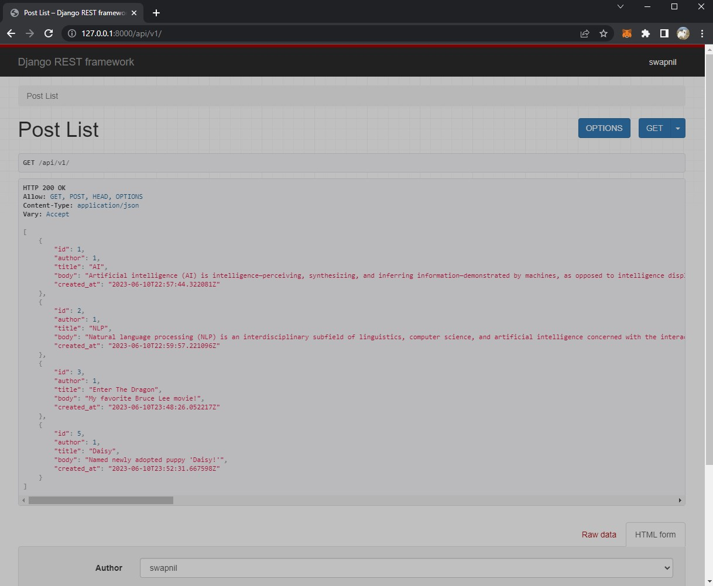
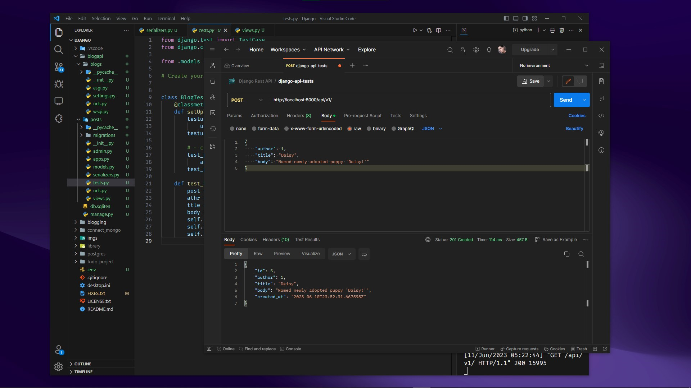

# Blog api tutorial

## Introduction
- Built this tiny project to get started with API developement with Django.

## Working
- Below image shows we have list of blogs on display.
- When we visite the url _`api/v1/`_ route return/gets all the blogs from the database. (__GET__ method)
  

- In below image I've posted raw data via postman (basically performed __POST__ method)
- result can be seen on above image, as the data reflect on our _`/api/v1/`_ url and database.

