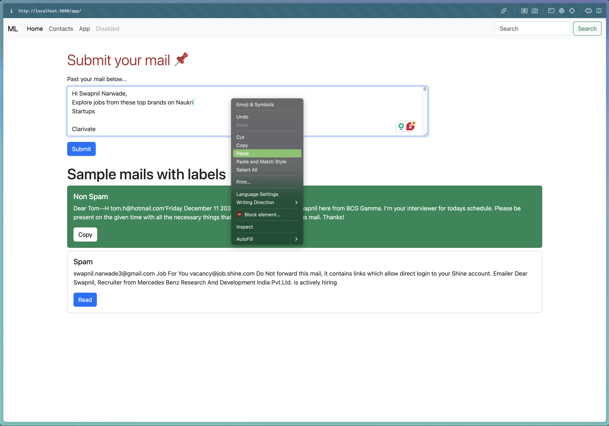

# Spam-Ham emails Classification App 🔖

---

## Overview

This web application is designed to classify emails into "Spam" or "Ham" (non-spam) categories using a machine learning model built with the Naive Bayes classification algorithm. The app is developed using Django for web development and Scikit-learn for implementing the classification model.

## Features

- **Email Classification**: Input an email text into the app, and it will predict whether the email is spam or ham.
- **User-Friendly Interface**: The web interface is designed to be intuitive and easy to use.

---

## Preview

### Home Page

### Copy Email

### Paste Text in the App

### Prediction Page

### Another Response Page

